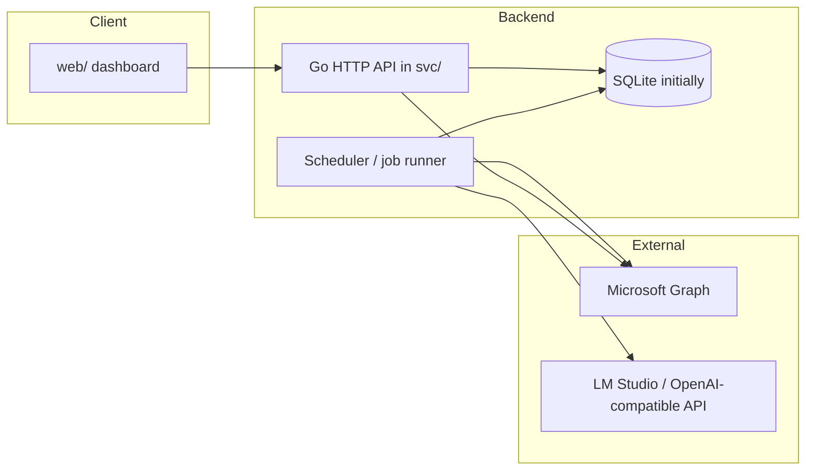
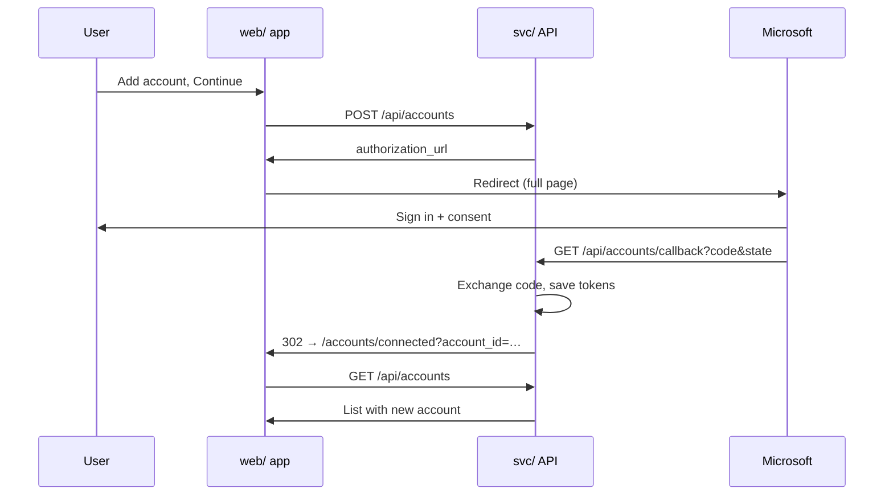
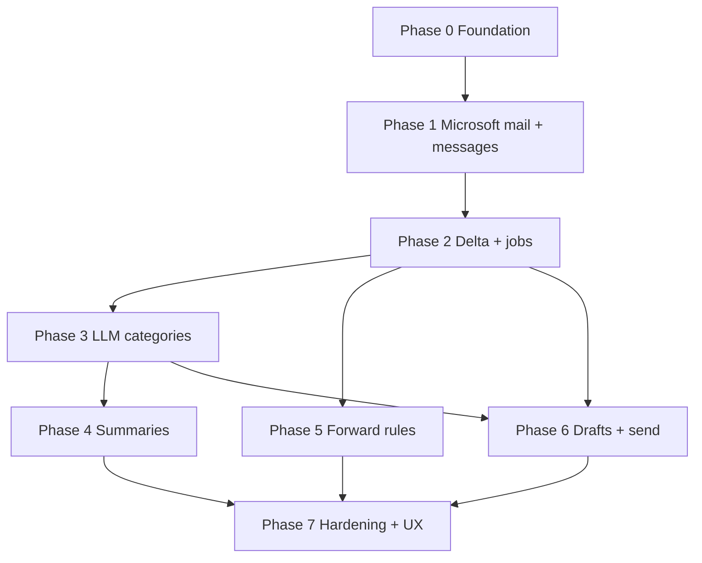

# Technical Specification: Email Automation Platform (v1)

**Status:** Draft  
**Companion PRD:** [docs/prds/initial.md](../prds/initial.md)  
**Related addenda:** [Redis, Asynq, and the job runner](addendum-redis-asynq-jobs.md) · [Project correspondence Wave 1](addendum-project-correspondence-wave1.md)  
**Last updated:** 2026-04-25 (monorepo `svc/`/`web/`, Go backend, Phase 1 API-only)

This document specifies architecture, data model, integrations, APIs, and operational behavior. The **PRD** remains the source of product intent; this document is the source of **implementation invariants** (especially **multi-account provenance**).

---

## 1. System context



- The **`web/`** app (React per [§10](#10-react-dashboard-contract)) talks only to the **`svc/`** HTTP API (same origin or CORS-controlled).
- **Background work** (sync, summarize, rules) runs in a **job runner** invoked by a **scheduler** and by **on-demand** API calls; both paths **mutate state only through the same domain services** so behavior and provenance stay consistent.
- **LLM** is **out of process**; the backend calls it over HTTP with a configurable base URL and model name.

---

## 2. Architectural principles

### 2.0 Repository layout (`svc/` and `web/`)

The repository root has **two top-level directories**:

| Directory | Role |
| --------- | ---- |
| **`svc/`** | **Backend:** Go service(s), migrations, domain/application/adapters code per [§2.4](#24-backend-project-structure-ddd-hexagonal-ports-and-adapters). |
| **`web/`** | **Frontend:** reserved for the React dashboard ([§10](#10-react-dashboard-contract)); product UI is **not** implemented in **Phase 1** (see [§12.1](#121-phase-1--microsoft-mail-read--message-store)). |

**Phase 0–1:** Ship and verify behavior from **`svc/`** only (HTTP API, persistence, Microsoft integration). **`web/`** should still exist as a **placeholder** (for example `README.md` describing the future app, or a minimal scaffold) so CI, documentation, and **`CORS_ORIGINS` / `DASHBOARD_BASE_URL`** have a stable target for when the UI lands in a later phase.

### 2.1 Provenance (non-negotiable)

Every persistent record that represents **user data**, **derived intelligence**, or **side effects** **must** include:

- **`account_id`**: UUID (or stable surrogate) referencing `accounts.id`, **except** entities that are explicitly global (see below).
- Where the row is **produced by automation**, **`run_id`** (nullable FK to `job_runs`) **should** be set so operators can trace “which execution wrote this.”

**Global entities** (no `account_id`): user-level settings, global category **definitions** (the vocabulary), and **forward_allowlist** entries if shared across accounts (optional; see [§4](#4-data-model)). **Every** message, category **assignment**, summary, draft, forward audit, and provider token **must** be account-scoped.

**Cross-account APIs** return lists or aggregates where **each item** includes `account_id` (and usually `account_label` for UI). Never return merged message lists without per-row account identity.

### 2.2 Idempotency and provider identity

- Store the provider’s **immutable message identifier** per account (for Microsoft Graph: `id` on [message](https://learn.microsoft.com/en-us/graph/api/resources/message) resources). **Unique constraint:** `(account_id, provider_message_id)`.
- Sync uses **delta** (or equivalent incremental strategy) per account; persist **delta link or cursor** per `account_id` for resumable sync.

### 2.3 Single operator

- One **logical user** in v1 (`user_id` optional in schema for future multi-user hosting; can be fixed to a single row).

### 2.4 Backend project structure (DDD, hexagonal, ports and adapters)

The backend in **`svc/`** is implemented in **Go** and follows **domain-driven design** naming and a **hexagonal (ports and adapters)** layout so **HTTP**, **schedulers**, and **future CLIs** are thin **driving adapters** into the same **application** (use-case) layer, which orchestrates **domain** rules and persists through **driven ports** implemented in infrastructure.

**Dependency direction:** `adapters` → `application` → `domain`. The **domain** package must not import HTTP frameworks, SQL drivers, Microsoft SDKs, or other adapters. **Application** code depends on **domain** types and small **interfaces** (ports) only; **adapters** in `internal/adapters/...` implement those interfaces (`database/sql`, Graph REST client, OAuth2 token exchange, etc.).

**Suggested layout under `svc/`** (names are normative; adjust `internal/` subtree names to match the Go module path):

```text
svc/
  cmd/server/                # HTTP API entrypoint: wiring, listen, graceful shutdown
  cmd/worker/                # optional: separate binary for jobs when isolation is needed
  internal/
    domain/                  # entities, value objects, domain services, invariants
      accounts/
      messages/
      shared/                # cross-cutting value types (e.g. identifiers) if needed
    application/             # use cases; orchestration only
      accounts/
      messages/
      ports/                 # driven port interfaces consumed by application
    adapters/
      inbound/
        http/                # e.g. chi/echo/std net/http handlers → application use cases
        schedule/            # cron / ticker entrypoints → same use cases as HTTP
      outbound/
        persistence/         # sqlite/postgres repositories implementing ports
        microsoft/           # OAuth2 (authorization code) + Graph HTTP; map DTOs → domain
        security/            # token encryption at rest, etc.
  migrations/                # SQL migrations (goose, golang-migrate, Atlas, etc.)
```

**Composition root:** construct repositories, token vault, and mail clients in **`cmd/server/main.go`** (or a dedicated `internal/wiring` package) and pass them into application constructors. **Scheduled jobs** and **HTTP handlers** call the **same** application services, matching [§1](#1-system-context).

**Bounded contexts:** start with **`internal/domain/accounts`** and **`internal/domain/messages`** (and matching `application/` packages). Add further subtrees as features land (categorization, summaries, forwarding), each behind **ports** rather than leaking infrastructure into domain.

**PostgreSQL** remains the natural choice for **later** multi-process hosting or heavier workloads; the **persistence adapter** stays behind repository ports so the store can be swapped without changing domain or application code.

---

## 3. Microsoft mail (Outlook / M365) via Graph

The same **Microsoft Graph** APIs apply to **work or school** mailboxes (Entra ID) and **personal** mailboxes (**Microsoft account** / MSA, for example @outlook.com, @hotmail.com, @live.com). v1 must support **both** as separate `account_id` connections. A **work-only (single-tenant) app registration** does not allow **consumer (personal) sign-in**; use an app type that **includes personal Microsoft accounts** (see [§3.1](#31-auth-and-account-types)).

### 3.1 Auth and account types

- **Entra / Azure app registration — supported sign-in audience:** To allow **personal Outlook** in the same app you use for work, register with **“Accounts in any organizational directory and personal Microsoft accounts”** (multi-tenant + MSA) or the equivalent. A **work-only, single-tenant** app **cannot** sign in **MSA (personal)** users.
- **Microsoft Entra** app (confidential client where applicable): **delegated** permissions to the signed-in mailbox.
- **OAuth 2.0 authorization code + refresh** (in Go: use a maintained Microsoft Entra / OAuth2 client or direct HTTP to the token endpoint; the spec does not require a particular SDK). **Store refresh token per `account_id`** (encrypted at rest). Access token refresh is internal to the connector before each Graph batch.
- **Authority** for each connect attempt (which login experience the user gets):
  - **`https://login.microsoftonline.com/organizations`** — work or school only;
  - **`https://login.microsoftonline.com/consumers`** — **personal** Microsoft account only;
  - **`https://login.microsoftonline.com/common`** — user may pick work or personal; use only if the product exposes a single “any Microsoft” button and the app registration supports both.

**`POST /api/accounts` body** (see [§6](#6-http-api-fastapi)) must include `ms_account_kind` with values **`work`** (use `organizations` authority) or **`personal`** (use `consumers` authority). Persist `ms_account_kind` on `accounts` (see [§4.2](#42-accounts)) for UI and support. **Graph** resource and `me` are unchanged; tokens for both paths access mail via the same API surface.

- **Scopes (initial):** identical for work and personal:
  - `https://graph.microsoft.com/Mail.Read`
  - `https://graph.microsoft.com/Mail.Send`
  - `https://graph.microsoft.com/User.Read`
  - `offline_access`
- **Day-one note:** In-app drafts do **not** use `Mail.ReadWrite`; PRD confirms drafts live in the app DB only.

**Consent:** For **work** tenants, **admin consent** may be required. For **personal** (MSA), the user consents in the **consumer** flow; there is no org admin; the user can revoke the app in their Microsoft account settings.

**Optional:** A single **“Use any Microsoft account”** CTA is allowed if the UI sets authority to `common` and the Entra app is registered for org + MSA, per above.

### 3.2 Read path

- **Mail folders:** Start with **Inbox** (configurable folder id per account later).
- **Incremental sync:** Prefer **delta query** for messages (`GET /me/messages/delta` or per-folder) with persisted **deltaLink** per account. Full resync path on invalid delta token.
- **Fetch body** for summarization: request `body` with `Prefer: outlook.body-content-type="text"` where possible to reduce HTML noise; normalize to plain text for LLM input and store a **normalized preview** in DB (see [§4](#4-data-model)).

### 3.3 Send path

- **Send draft (user-confirmed):** `POST /me/sendMail` with `message` payload built from app draft + threading metadata if available (`reply`/`forward` flows may use `createReply`, `createForward`, or send with appropriate headers—exact Graph calls are implementation details; spec requires **audited** `send_attempts` rows).
- **Rule-based forward:** Implement as **send** to the allowlisted recipient with clear `subject`/body indicating forward context, or use Graph forward API where appropriate; **always** check destination ∈ **allowlist** before calling Graph.

### 3.4 Rate limits and backoff

- Honor Graph **429** and `Retry-After` headers. Jobs record partial progress; **no duplicate sends** (use idempotency keys on `send_attempts` / rule execution rows).

---

## 4. Data model

Relational store: **SQLite** for the **initial** implementation and local development; **PostgreSQL** when scaling to multi-process servers or stricter production needs. The logical model below uses **snake_case** and **UTC** timestamps; map `timestamptz` to SQLite-compatible types (e.g. ISO8601 text or numeric epoch) in migrations—the **invariants** (uniqueness, FKs, provenance) are unchanged.

### 4.1 `users` (optional v1)

| Column     | Type   | Notes        |
| ---------- | ------ | ------------ |
| `id`       | UUID PK| Single row ok|
| `created_at` | timestamptz | |

If omitted, use application singleton or omit table.

### 4.2 `accounts`

| Column              | Type        | Notes |
| ------------------- | ----------- | ----- |
| `id`                | UUID PK     |       |
| `label`             | text        | User-facing name, e.g. “Work” |
| `provider`          | enum string | e.g. `m365` (Microsoft Graph), later `google_workspace` ([§13.1](#131-planned-phase-google-workspace)) |
| `ms_account_kind`   | enum string | `work` \| `personal` (which authority was used at connect) |
| `graph_tenant_id`   | text nullable | For work: tenant id; for **personal** MSA often a placeholder or claim-derived id—document behavior |
| `primary_email`     | text        | Mailbox UPN or SMTP |
| `msal_home_account_id` | text nullable | Stable **home account** identifier from the identity platform for token cache binding (name retained for compatibility; set when the OAuth library exposes it) |
| `connection_status` | enum        | `connected` \| `error` \| `expired` \| … |
| `last_error`        | text nullable | Sanitized, no secrets |
| `created_at` / `updated_at` | timestamptz | |

**OAuth tokens (encrypted payload or column-level encryption):**

- `token_ciphertext` or KMS-style reference; **never** log.

### 4.3 `account_sync_state`

| Column         | Type | Notes |
| -------------- | ---- | ----- |
| `account_id`   | UUID PK/FK | one row per account |
| `delta_link`   | text nullable | Graph delta URL |
| `last_synced_at` | timestamptz | |
| `cursor_json`  | jsonb nullable | extensibility for non-delta providers |

### 4.4 `messages`

| Column                 | Type | Notes |
| ---------------------- | ---- | ----- |
| `id`                   | UUID PK | Internal |
| `account_id`           | UUID FK, indexed | **Provenance** |
| `provider_message_id`  | text | Graph `id` |
| `conversation_id`    | text nullable | Graph if present |
| `received_at`          | timestamptz | |
| `subject`              | text | |
| `from_json`            | jsonb | `{ "name", "address" }` |
| `to_cc_preview`        | text nullable | optional denormalized |
| `body_text`            | text nullable | normalized for LLM |
| `body_fetched_at`      | timestamptz nullable | |
| `has_attachments`      | boolean | |
| `raw_etag`             | text nullable | optional for conflict detection |
| `created_at` / `updated_at` | timestamptz | |

**Unique:** `(account_id, provider_message_id)`.

### 4.5 `category_definitions`

Global vocabulary: `id`, `slug` (e.g. `important`, `spam`, `finance`, `other`), `display_name`, `sort_order`.

### 4.6 `message_categories`

| Column        | Type | Notes |
| ------------- | ---- | ----- |
| `id`          | UUID PK | |
| `message_id`  | UUID FK | implies account via message |
| `account_id`  | UUID FK, indexed | **denormalized for provenance queries**; must match `messages.account_id` |
| `category_id` | UUID FK | |
| `source`      | enum | `llm` \| `rule` \| `user` |
| `confidence`  | float nullable | |
| `run_id`      | UUID FK nullable | |

**Invariant:** `message_categories.account_id` = `messages.account_id` for the same `message_id` (enforce in app or trigger).

### 4.7 `job_runs`

| Column         | Type | Notes |
| -------------- | ---- | ----- |
| `id`           | UUID PK | |
| `account_id`   | UUID FK nullable | null = “all accounts” job only if defined; prefer **per-account** runs for traceability |
| `job_type`     | enum | `sync` \| `summarize` \| `categorize` \| `forward_rules` \| `draft_suggest` |
| `trigger`      | enum | `schedule` \| `api` |
| `status`       | enum | `pending` \| `running` \| `success` \| `failed` \| `cancelled` |
| `time_window_start` / `end` | timestamptz nullable | for summarize |
| `started_at` / `finished_at` | timestamptz | |
| `error_message` | text nullable | |
| `meta_json`   | jsonb | model name, request counts, etc. |

### 4.8 `summary_snapshots`

| Column        | Type | Notes |
| ------------- | ---- | ----- |
| `id`          | UUID PK | |
| `account_id`  | UUID FK | |
| `run_id`      | UUID FK | |
| `generated_at`| timestamptz | |
| `window_start` / `window_end` | timestamptz | |
| `payload_json`| jsonb | **Structured** summary (action items, FYI, per-message refs) |
| `model`       | text | LLM model id used |

`payload_json` must store **internal message UUIDs** (and optionally provider ids) so UI can deep-link; each bullet includes `message_id` + `account_id` redundantly is allowed for safety.

### 4.9 `llm_artifacts` (optional but useful for debug)

| Column       | Type | Notes |
| ------------ | ---- | ----- |
| `id`         | UUID PK | |
| `account_id` | UUID FK | |
| `run_id`     | UUID FK | |
| `step`       | text | e.g. `categorize_batch_3` |
| `input_hash` | text | optional dedupe |
| `output_json`| jsonb | parsed JSON; **no secrets** |
| `raw_text`   | text nullable | truncate; only if storage policy allows |

### 4.10 `forward_allowlist`

| Column  | Type | Notes |
| ------- | ---- | ----- |
| `id`    | UUID PK | |
| `email` | citext or normalized text | **unique** |

### 4.11 `forward_rules`

| Column           | Type | Notes |
| ---------------- | ---- | ----- |
| `id`             | UUID PK | |
| `account_id`     | UUID FK | **per PRD: scoped per account** |
| `name`           | text | |
| `enabled`        | boolean | default false in conservative deployments |
| `condition_json` | jsonb | see [§5.2](#52-rule-condition-schema) |
| `forward_to`     | text | must match allowlist at save time and at execution |
| `created_at` / `updated_at` | timestamptz | |

### 4.12 `forward_audit`

| Column        | Type | Notes |
| ------------- | ---- | ----- |
| `id`          | UUID PK | |
| `account_id`  | UUID FK | |
| `message_id`  | UUID FK | |
| `rule_id`     | UUID FK | |
| `status`      | enum | `sent` \| `failed` \| `skipped_not_allowed` |
| `detail`      | text nullable | error or skip reason |
| `run_id`      | UUID FK | |
| `created_at`  | timestamptz | |

**Idempotency:** unique `(message_id, rule_id)` or store last result only—product choice; avoid double-send.

### 4.13 `drafts` (in-app)

| Column        | Type | Notes |
| ------------- | ---- | ----- |
| `id`          | UUID PK | |
| `account_id`  | UUID FK | **Provenance** |
| `message_id`  | UUID FK | target thread |
| `run_id`      | UUID FK nullable | |
| `body_text`   | text | |
| `status`      | enum | `suggested` \| `edited` \| `discarded` |
| `context_json` | jsonb nullable | **Future:** per-account context bundle; **never** mix two accounts in one object |
| `created_at` / `updated_at` | timestamptz | |

### 4.14 `send_attempts`

| Column        | Type | Notes |
| ------------- | ---- | ----- |
| `id`          | UUID PK | |
| `account_id`  | UUID FK | |
| `draft_id`    | UUID FK nullable | |
| `message_id`  | UUID FK nullable | reply/forward target |
| `status`      | enum | `pending` \| `sent` \| `failed` |
| `provider_response_json` | jsonb nullable | non-secret subset |
| `idempotency_key` | text unique nullable | |
| `created_at`  | timestamptz | |

---

## 5. LLM integration

### 5.1 Transport

- **OpenAI-compatible** `POST {base}/v1/chat/completions` (config: `LLM_BASE_URL`, `LLM_API_KEY` optional, `LLM_MODEL`).
- **Timeouts** and **max tokens** per call type. **Per-account** optional overrides later (`accounts.llm_config_json`).

### 5.2 Rule condition schema (example)

**`forward_rules.condition_json`:**

```json
{
  "type": "and",
  "clauses": [
    { "type": "category_equals", "slug": "finance" },
    { "type": "llm_field", "path": "invoice_likelihood", "gte": 0.7 }
  ]
}
```

LLM can emit `invoice_likelihood` in a **categorization** JSON (see [§5.3](#53-json-prompt-contracts)) stored on `message` extension json or a side table; v1 can simplify to **category + keyword** only.

### 5.3 JSON prompt contracts

The backend **must** define **versioned** JSON shapes. Prompts end with: **“Respond with a single JSON object only, no markdown.”** Implement:

1. Parse JSON strictly.
2. On failure: **one** automatic retry with a “fix to valid JSON” system message **or** a small repair function (escape handling only).
3. If still invalid: mark run step failed; **do not** write partial category/summary to user-visible tables without a `source`/`degraded` flag (optional v1: fail the step).

**Example: per-message triage (one object):**

```json
{
  "schema_version": 1,
  "category_slug": "finance",
  "action_items": [
    { "text": "Pay invoice by Friday", "due_date": "2026-04-30" }
  ],
  "fyi": [
    { "text": "Policy update effective next month" }
  ],
  "needs_reply": true,
  "forward_hints": { "invoice_likelihood": 0.9 }
}
```

**Example: batch daily summary (aggregated for one `account_id` only in a single call):**

```json
{
  "schema_version": 1,
  "action_items": [
    { "text": "…", "message_ref": "internal-uuid-of-message" }
  ],
  "fyi": [
    { "text": "…", "message_ref": "internal-uuid-of-message" }
  ],
  "notes": "Optional freeform for UI debugging"
}
```

**Invariants:** Every `message_ref` must belong to the **same** `account_id` as the run; the server **validates** before persisting `summary_snapshots`.

**Draft generation prompt** accepts `account_id`, `message` excerpt, and optional `context_json` **for that account only**; output:

```json
{
  "schema_version": 1,
  "subject_suggestion": "Re: …",
  "body": "…"
}
```

---

## 6. HTTP API (Go service in `svc/`)

The **`svc/`** process exposes the routes below (for example via **chi**, **Echo**, or **`net/http`**). **Conventions:** JSON bodies. **`X-Request-ID`** correlation. All list responses that touch mail include **`account_id`** on each item. **Auth** for v1: session cookie or API key for local use (TBD; document in deployment).

| Method & path | Purpose |
| ------------- | ------- |
| `GET /api/health` | Liveness. |
| `GET /api/accounts` | List accounts + connection status. |
| `POST /api/accounts` | **Start connect flow:** body e.g. `{ "provider": "m365", "ms_account_kind": "work" \| "personal" }` (and optional `label` hint). `personal` = personal Outlook/MSA (`consumers` authority); `work` = org accounts (`organizations` authority), per [§3.1](#31-auth-and-account-types). Returns `{ "authorization_url", "state" }` for the browser. Server stores `state` to validate the callback (see [§6.1](#61-oauth-and-account-connection-backend)). |
| `GET /api/accounts/callback` | **OAuth callback** (`code`, `state`, `error?` from IdP). Validates `state`, exchanges code, creates/updates `accounts` + tokens; then **HTTP 302** redirect to a **frontend route** (see [§6.1](#61-oauth-and-account-connection-backend) and [§10.1](#101-account-connection-flow-ui)) with non-sensitive `account_id` on success, or to an error route on failure. **Must not** leak tokens in query strings. |
| `GET /api/accounts/{id}` | Detail. |
| `DELETE /api/accounts/{id}` | Disconnect; revoke if implemented; delete tokens. |
| `POST /api/accounts/{id}/sync` | On-demand **sync** job; returns `job_run` id. |
| `GET /api/messages` | Query params: `account_id` (required or filter), `category`, `since`, paginate. |
| `GET /api/messages/{id}` | Detail; assert caller scope. |
| `GET /api/summaries` | Query: `account_id`, optional `date`; latest `summary_snapshots`. |
| `POST /api/accounts/{id}/summaries/refresh` | Enqueue **summarize** for window (body: `window_hours` default 24). |
| `GET /api/forward-allowlist` | CRUD allowlist. |
| `PUT /api/forward-allowlist` | Replace or add entries. |
| `GET /api/accounts/{id}/forward-rules` | List rules. |
| `POST /api/accounts/{id}/forward-rules` | Create (validate `forward_to` ∈ allowlist). |
| `PATCH /api/forward-rules/{id}` | Update. |
| `GET /api/accounts/{id}/drafts` | List in-app drafts. |
| `POST /api/messages/{id}/drafts` | Generate draft (LLM); creates `drafts` row. |
| `POST /api/drafts/{id}/send` | **User-confirmed** send; creates `send_attempts`, calls Graph. |
| `GET /api/runs` / `GET /api/runs/{id}` | Job status for dashboard polling. |

### 6.1 OAuth and account connection (backend)

- **`state`:** Random, unguessable, **one-time** (or time-bounded + signed) value. Persist server-side and validate on `GET /api/accounts/callback` before exchanging `code` for tokens. Reject the callback if `state` is missing, expired, or mismatched.
- **Success response:** `302` redirect to a **frontend** URL only (e.g. `{DASHBOARD_BASE_URL}/accounts/connected?account_id={uuid}`). Pass **at most** the internal `account_id` (non-secret). **Do not** put access tokens, refresh tokens, or Graph IDs in the query string.
- **Failure response:** `302` to an app error route (e.g. `{DASHBOARD_BASE_URL}/accounts/error?code=…`) with **stable, client-readable** `code` values such as: `access_denied`, `admin_consent_required`, `invalid_state`, `token_exchange_failed`, `redirect_mismatch` (so the UI can show the right [§10.1](#101-account-connection-flow-ui) recovery copy).
- **Re-connect:** Running `POST /api/accounts` again for a user who may already have accounts is the same as “add another” unless you implement a dedicated **re-link** that pairs with an existing `account_id` (optional; otherwise user **Disconnect** then add again, or add a second account).
- **`redirect_uri` in Entra:** Must be the **API** callback (e.g. `https://api…/api/accounts/callback`), not the **`web/`** dev server URL, and must **exactly** match the app registration.

**WebSocket (optional):** `WS /api/runs/{id}/stream` for job progress; not required for v1 if polling is acceptable.

---

## 7. Scheduler and job runner

- **In-process** scheduling in Go (for example `robfig/cron` or a simple **goroutine + ticker** for v1), **or** a **separate worker binary** under `svc/cmd/worker` with **Redis** / queue if isolation is required. For **Redis + [Asynq](https://github.com/hibiken/asynq)** (queues, concurrency, observability, real-time push pattern), see the **[addendum: Redis, Asynq, and the job runner](addendum-redis-asynq-jobs.md)**. Minimum behavior:
  - **Nightly (per account):** `sync` → `categorize` (if separate) → `summarize` → `forward_rules` (if enabled).
  - **Concurrency:** at most one **sync** per `account_id` at a time; **LLM** calls batched with concurrency limits to avoid OOM on LM Studio host.
- **On-demand** endpoints enqueue the same `job_type` with `trigger=api`.

**Logging:** every job log line includes **`run_id`**, **`account_id`** (if any), and **`job_type`**.

---

## 8. Security

- **Secrets:** environment variables or secret file; **never** commit tokens.
- **Encryption at rest** for token columns (DB or filesystem encryption).
- **PII in logs:** avoid raw email bodies; log ids and short subjects only.
- **CORS** restricted to the dashboard origin in non-local deploys.
- **Allowlist** enforced server-side for every forward and at rule save time.

---

## 9. Configuration (environment)

| Variable | Purpose |
| -------- | ------- |
| `DATABASE_URL` | SQL store DSN or path. **SQLite:** e.g. `file:./data.db` or driver-specific DSN supported by the chosen driver (`modernc.org/sqlite`, `mattn/go-sqlite3`, etc.). **PostgreSQL:** standard `postgres://…` URL when using `pgx` / `lib/pq`. |
| `MS_CLIENT_ID` / `MS_CLIENT_SECRET` | Entra app. |
| `MS_REDIRECT_URI` | Must match app registration. |
| `MS_AUTHORITY` | **Default** host only if you do not build URLs per [§3.1](#31-auth-and-account-types); in practice the backend **constructs** `.../organizations` vs `.../consumers` from `ms_account_kind` on `POST /api/accounts` (or override `MS_AUTHORITY_ORGANIZATIONS` / `MS_AUTHORITY_CONSUMERS` for rare clouds). |
| `LLM_BASE_URL` / `LLM_MODEL` / `LLM_API_KEY` | Local LM Studio. |
| `CORS_ORIGINS` | Comma list. |
| `DASHBOARD_BASE_URL` | Origin of the future **`web/`** app (for example `http://localhost:5173` in dev), used to build `302` targets after OAuth (see [§6.1](#61-oauth-and-account-connection-backend)). Must align with **`CORS_ORIGINS`** when the UI is enabled. |
| `OAUTH_SUCCESS_PATH` / `OAUTH_ERROR_PATH` | Optional path suffixes; default e.g. `/accounts/connected` and `/accounts/error` if you avoid separate `OAUTH_SUCCESS_URL`. |
| `SCHEDULER_UTC_CRON` | Nightly default. |
| `ENCRYPTION_KEY` | For token field (if not using host KMS). |

---

## 10. React dashboard (contract)

The production dashboard is implemented under repository **`web/`** (see [§2.0](#20-repository-layout-svc-and-web)). **Phase 1** does **not** ship this UI; the contracts below remain the **authoritative product contract** for when **`web/`** is built.

- **Account switcher** + visible **account badge** on every message/summary line.
- **Refresh summary** → `POST .../summaries/refresh` then poll `GET /api/runs/{id}` or refetch `GET /api/summaries`.
- **No client-side merging** of data without displaying `account_id`.

### 10.1 Account connection flow (UI)

**Primary entry point:** A **Settings → Accounts** (or **Accounts** in the main nav) screen that is available **before** the user has any mailbox connected (not a dead end).

| Step | User action | UI | Backend / notes |
| ---- | ----------- | -- | --------------- |
| 1 | Open Accounts | If **no accounts:** show **empty state** (copy: connect **work or personal** Outlook) + primary CTA **Add account**. If **one or more:** show **table or cards** with `label`, `primary_email`, **`ms_account_kind` badge** (work vs personal), `connection_status`, last sync, actions **Add another** / **Disconnect** / **Reconnect** / **Test sync** (optional). | — |
| 2 | Click **Add account** | **Modal or full-page** step: v1 = **Microsoft mail** only, then **two** explicit choices: **Work or school** vs **Personal (Outlook, Hotmail, Live)**. Short privacy note. **Continue** sends `ms_account_kind` matching the user’s choice. | If you also offer a single **Any Microsoft account** path, it must set authority to `common` and the Entra app must allow org + MSA, per [§3.1](#31-auth-and-account-types). |
| 3 | **Continue** | `POST /api/accounts` with `{ "provider": "m365", "ms_account_kind": "work" }` or `{ "provider": "m365", "ms_account_kind": "personal" }`. Show **loading**; on 200, **set `window.location.href = authorization_url`**. | Server returns Microsoft authorization URL and `state`. |
| 4 | (Browser) | **Work or school:** user may see **org admin approval** in locked-down tenants. **Personal:** user signs in with MSA; no org admin. | Microsoft redirects to `GET /api/accounts/callback?…`. |
| 5 | Return to app | App loads **success** route (e.g. `/accounts/connected?account_id=…` per [§6.1](#61-oauth-and-account-connection-backend)). **Fetch** `GET /api/accounts` and highlight the new row; show toast **“Account connected”**. Offer **Sync now** → `POST /api/accounts/{id}/sync`. | If callback redirected to **error** route, show **reversible** error: consent denied, admin approval needed, or misconfigured redirect; **Try again** → back to step 2. |
| 6 | **Add another** | Same as 2–5; new row appears with a **distinct** `account_id` (provenance in the list is obvious). | — |
| 7 | **Disconnect** | Confirm dialog. `DELETE /api/accounts/{id}`. Remove from local nav/switcher; if last account, show **empty state** from step 1. | — |
| 8 | **Token expired** | `connection_status` from `GET /api/accounts` shows error/expired. Banner or row badge: **Session expired — Reconnect** → same as step 2 (re-link flow per [§6.1](#61-oauth-and-account-connection-backend)). | — |

**Global guard:** If `GET /api/accounts` returns an empty list, the **default landing route** (Home / Summary) may show a **single CTA** pointing to **Accounts** to connect first, or an inline connect widget—product choice, but the **connect flow must** be discoverable without reading docs.

**Deep linking:** The React router **should** support loading `/settings/accounts` directly so a bookmarked “connect” path works after OAuth return.



### 10.2 Related configuration

Add to deployment env (see [§9](#9-configuration-environment)): **`DASHBOARD_BASE_URL` or** dedicated **`OAUTH_SUCCESS_URL`** / **`OAUTH_ERROR_URL`** if the success redirect is not always `{DASHBOARD_BASE_URL}/accounts/connected`.

---

## 11. Testing and verification (engineering)

- **Unit:** JSON schema validation for each LLM contract; allowlist check for rules.
- **Integration:** mock Graph; assert `(account_id, provider_message_id)` uniqueness and that cross-account **cannot** reference another account’s `message_id` in `summary_snapshots` validation.
- **Manual:** at least two connections (for example **work + personal** Outlook, or two of one kind) to verify **provenance** and `ms_account_kind` in UI and DB.

---

## 12. Implementation phases

Phases are **sequential**: each phase produces something **shippable** and **testable**; later phases **depend** on earlier ones. **Multi-account provenance** (`account_id` on mail-derived rows) is introduced from **Phase 1** in the schema, even if the UI only connects one mailbox for a while.

| Phase | Name | Goal |
| ----- | ---- | ---- |
| 0 | Foundation | Runnable **`svc/`** Go API, DB, health, **`svc/`**/**`web/`** layout ([§2.0](#20-repository-layout-svc-and-web)). |
| 1 | Microsoft mail + message store | **`svc/`** API: connect **work and/or personal** account(s) via Graph, pull mail into `messages` with full provenance; **`web/`** UI deferred ([§12.1](#121-phase-1--microsoft-mail-read--message-store)). |
| 2 | Incremental sync + job runs | Delta (or resumable) sync, `job_runs`, scheduled + on-demand sync. |
| 3 | LLM categorization | JSON triage, `message_categories` + `category_definitions`. |
| 4 | Summaries | `summary_snapshots`, action items + FYI, refresh API, minimal UI. |
| 5 | Forward rules + allowlist | Allowlist CRUD, per-account rules, `forward_audit`, Graph send for forwards. |
| 6 | In-app drafts + user send | `drafts`, LLM body, `send_attempts`, explicit user send. |
| 7 | Hardening + dashboard UX | Resilience, logging, CORS, account UX, polish, tests. |

### 12.0 Phase 0 — Foundation

**Delivers:** **`svc/`** Go module with HTTP server, configuration (`DATABASE_URL`, `CORS_ORIGINS` placeholder), structured logging, `GET /api/health`, database migration tool and **initial schema** for `accounts` and `account_sync_state` (can be empty), **`internal/domain/`**, **`internal/application/`**, and **`internal/adapters/`** layout per [§2.4](#24-backend-project-structure-ddd-hexagonal-ports-and-adapters). **SQLite** as the default database for Phase 0. Repo root includes **`web/`** per [§2.0](#20-repository-layout-svc-and-web) (placeholder only in this phase). Optional: `users` single row or skip.

**Exit criteria:** Server starts; DB applies migrations; no mail or LLM yet.

**Why first:** Every later phase needs a place to store tokens and `account_id` FKs.

### 12.1 Phase 1 — Microsoft mail read + message store

**Delivers:** Entra app with **work + personal Microsoft accounts** as supported sign-in types (per [§3.1](#31-auth-and-account-types)), env + **OAuth2 authorization-code flow** (refresh tokens stored per account), **per-request authority** for `ms_account_kind` `work` vs `personal`, OAuth start (`POST /api/accounts`) + callback (`GET /api/accounts/callback`), encrypted **refresh token per account** in `accounts` with `ms_account_kind` persisted. Microsoft Graph: **list and fetch** messages (Inbox) into `messages` with `provider_message_id` and **unique** `(account_id, provider_message_id)`. APIs: `GET /api/accounts`, `GET /api/accounts/{id}`, `DELETE /api/accounts/{id}`, `POST /api/accounts/{id}/sync` (sync can be synchronous in this phase to simplify debugging). Configure **`CORS_ORIGINS`** and **`DASHBOARD_BASE_URL`** so a future **`web/`** app can call the API and receive OAuth **302** redirects to the URLs described in [§6.1](#61-oauth-and-account-connection-backend) and [§10.1](#101-account-connection-flow-ui).

**Out of scope for Phase 1:** **No React (or other) UI in `web/`** — the dashboard flow in [§10.1](#101-account-connection-flow-ui) is **not** implemented in this phase. Verify connect, sync, list, and disconnect via **automated tests** (mocked Graph where practical), **`curl`**, or **OpenAPI**/**Bruno**/Postman against **`svc/`**; document manual steps in `svc/` (or repo) README.

**Exit criteria:** At least one **work** and one **personal** connection can be created (or two of same type) with **distinct** `account_id` rows; messages never cross accounts; `ms_account_kind` is correct in the API and DB; **`web/`** exists at repo root as reserved space per [§2.0](#20-repository-layout-svc-and-web).

**Depends on:** Phase 0.

### 12.2 Phase 2 — Incremental sync + job runs

**Delivers:** **Delta** (or equivalent) in `account_sync_state`; `job_runs` with `job_type=sync`, `trigger` in `{schedule, api}`; scheduler triggers nightly sync **per** `account_id`; 429/retry **basic** policy. `GET /api/messages?account_id=…`, `GET /api/runs` / `GET /api/runs/{id}` for status.

**Exit criteria:** Re-run sync fetches only deltas; `job_runs` records every run with `account_id` where applicable.

**Depends on:** Phase 1.

### 12.3 Phase 3 — LLM categorization

**Delivers:** HTTP client to OpenAI-compatible `LLM_BASE_URL` **with timeouts**. Versioned **JSON** triage contract (see [§5.3](#53-json-prompt-contracts)); parse + retry on invalid JSON. Populate `message_categories` with `source=llm`, `run_id` set. Batch strategy (single message vs batch) as needed for LM Studio performance.

**Exit criteria:** New mail after sync gets categories with correct `account_id` on both message and category row.

**Depends on:** Phase 2. **Graph Send is not required** for this phase.

### 12.4 Phase 4 — Summaries

**Delivers:** `summary_snapshots` with `payload_json` referencing **internal** `message` ids; validation that all refs share the **run’s** `account_id`. Pipeline job `summarize` (scheduled + `POST /api/accounts/{id}/summaries/refresh`). **React (or static HTML)**: list latest summary, **account badge**, "Refresh" control.

**Exit criteria:** Daily summary and on-demand refresh both create new snapshot rows with distinct `run_id`.

**Depends on:** Phase 3 (or 2 if you use deterministic stub summaries first—**recommended: implement after** categorization for cleaner prompts).

### 12.5 Phase 5 — Forward rules + allowlist

**Delivers:** `forward_allowlist`, per-account `forward_rules` (conditions initially simple: `category_slug` or keyword; LLM `forward_hints` optional). **Enforce** allowlist on create and on execution. `forward_audit` for every attempt. **Graph** `POST /me/sendMail` (or forward) to deliver rule-based forwards only to allowlisted addresses.

**Exit criteria:** Rule fires once per idempotency design; no send to a non-allowlisted address; audit row exists.

**Depends on:** Phase 2 (send path can be stubbed in Phase 2 for tests; **must** be real in this phase).

### 12.6 Phase 6 — In-app drafts + user send

**Delivers:** `drafts` with `context_json` nullable (for future use). `POST` generate draft for a `message_id` (LLM returns JSON with `body`). `POST /api/drafts/{id}/send` creates `send_attempts`, calls Graph **send** with user confirmation in UI. No mailbox Drafts folder.

**Exit criteria:** Send appears in Sent Items for that account; `send_attempts` records outcome.

**Depends on:** Phase 2 and LLM from Phase 3 patterns (Phase 4 not strictly required if Drafts is prioritized—**if you reorder**, keep **send** after **Graph read** is stable). Recommended order: **4 → 5 → 6** as in the table to avoid custom priorities.

**Optional reorder note:** If **reply drafting** is higher priority than **auto-forward rules**, swap Phase 5 and Phase 6 *after* Phase 2; **provenance and allowlist** rules still apply to whichever phase “send to arbitrary address” appears first (rules before broad send).

### 12.7 Phase 7 — Hardening + dashboard UX

**Delivers:** Full **React** app in **`web/`** per [§10](#10-react-dashboard-contract) (account switcher, all lists with `account_id` visible, error states for token expiry, run polling). E2E or integration tests (mocked Graph) for [§11](#11-testing-and-verification-engineering). Production-minded **CORS**, secret handling, and **no** sensitive logging.

**Exit criteria:** `README` run instructions for **`svc/`** and **`web/`**; two-account manual test passes in the UI.

**Depends on:** Phases 0–6 (or 0–4 + 6 if Phase 5 deferred per optional reorder above).

### 12.8 Dependency graph (summary)



*If Phase 5 and Phase 6 are reordered, update edges accordingly: both still feed Phase 7.*

---

## 13. Future extensions (non-blocking)

- **Per-account** LLM and prompt profile in `accounts.llm_config_json`.
- **Observability:** OpenTelemetry traces with `account_id` on spans (low cardinality). When using the **Asynq** job runner, apply the same tracing and structured-log fields for **`run_id`** and **`job_type`** as described in **[addendum: Redis, Asynq, and the job runner](addendum-redis-asynq-jobs.md#8-logging-and-tracing)**.
- Generic **IMAP** / other providers as further connectors (lower priority unless required).

### 13.1 Planned phase: Google Workspace (work mail)

This is a **named follow-on** after Microsoft mail is stable (after [Phase 7](#127-phase-7--hardening--dashboard-ux) or once core pipelines are proven). It **does not** change provenance invariants: each Google connection is a normal **`accounts`** row with a **new** `provider` value (for example `google_workspace`) and its own OAuth tokens and `account_sync_state`.

**Product:** Let the user connect a **Google Workspace** (organizational Gmail) account the same way they connect Microsoft mail: **Settings → Accounts → Add account → Google (work)** (or similar), complete **Google OAuth**, return to the app, then **sync / summarize / draft / send** with the same UI patterns and **account badge** behavior.

**Integration (high level):**

- **APIs:** **Gmail API** (REST) for list/read/sync, send, and threading metadata; not IMAP for the primary path unless you add IMAP as a separate mode.
- **Auth:** **OAuth 2.0** with **Google Cloud** project, **OAuth consent screen**, and **restricted scopes** appropriate to the app (for example read/send mail—exact scope set to be chosen at implementation time and verified against [Google’s API Services User Data Policy](https://developers.google.com/terms/api-services-user-data-policy)). Store **refresh tokens per `account_id`** (encrypted), same as Microsoft.
- **Org / “work” considerations:** Google Workspace admins may restrict which third-party apps can access mail, or require **domain-wide delegation** for service-to-service scenarios. For a **single user** connecting their own mailbox, **delegated user OAuth** (sign in with Google) is the usual fit; document **admin approval** paths if the workspace blocks unverified apps.
- **Sync model:** Gmail **history** / incremental sync (or equivalent) with a **cursor stored in `account_sync_state.cursor_json`** per account; **unique** `(account_id, provider_message_id)` using Gmail **message ids**.
- **UI:** Extend the **provider chooser** in [§10.1](#101-account-connection-flow-ui) with a **Google (Workspace)** path; no mixing of Microsoft and Google tokens on the same row.
- **LLM and rules:** All downstream steps (categorize, summarize, forward rules, drafts) are **provider-agnostic** once `messages` rows exist; only the **connector** and **send** implementations branch on `provider`.

**Exit criteria (for that phase):** At least one Workspace account and one Microsoft account can be connected **together**; summaries and lists show **correct `account_id`** for each item; send and forward respect allowlist and audit for **both** providers.

**Dependency:** Treat the Microsoft implementation as the **template** for abstractions (`MailConnector`, sync job, send adapter) so Google is an **additional** implementation, not a fork of business logic.

---

*End of technical specification. Implementation PRs should reference this document and the PRD for behavioral and provenance review.*
